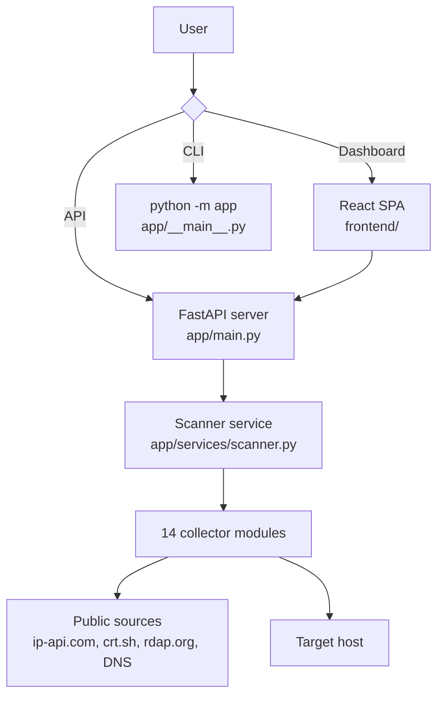

<p align="center">
  <picture>
    <source media="(prefers-color-scheme: dark)" srcset="https://img.shields.io/badge/GeoIntel-OSINT%20Console-%23C9B1FF?style=for-the-badge&labelColor=1a1a2e">
    
  </picture>
</p>

<p align="center">
  <a href="https://github.com/zanesense/geointel/actions/workflows/ci.yml"></a>
  <a href="https://github.com/zanesense/geointel/actions/workflows/codeql.yml"></a>
  <a href="https://github.com/zanesense/geointel/blob/main/LICENSE"></a>
  <a href="https://www.python.org/downloads/"></a>
  <a href="https://vercel.com"></a>
  
</p>

<h3 align="center">IP & domain intelligence — dashboard, CLI, and JSON API in a single workspace</h3>

<p align="center">
  <a href="#-quick-start"><b>Quick start →</b></a>
  &nbsp;·&nbsp;
  <a href="#-usage"><b>Usage →</b></a>
  &nbsp;·&nbsp;
  <a href="#-collectors"><b>Collectors →</b></a>
  &nbsp;·&nbsp;
  <a href="https://geointel-eight.vercel.app"><b>Live demo →</b></a>
</p>

---

## Overview

GeoIntel is an open-source OSINT workspace that consolidates 14 infrastructure intelligence modules behind a single interface. Enter an IP address, domain name, or URL and get back geolocation, DNS records, WHOIS registration, SSL certificate details, HTTP security headers, RDAP metadata, subdomain discoveries, email security posture, port scans, and more.

Three surfaces, one engine:

- **Dashboard** — React SPA with interactive map, per-module result views, and optional OpenCage enrichment
- **CLI** — `python -m app` with formatted output for pipelining and scripting
- **JSON API** — RESTful endpoints returning structured results for integration

> ⚠️ **Authorization is non-negotiable.** Port scanning, banner collection, connectivity checks, and DNS zone-transfer probes are active operations. Use this tool only on assets you own or have written permission to test.

---

## Features

- 🛰️ **14 intelligence modules** — geolocation, DNS, WHOIS, SSL/TLS, HTTP headers, reverse DNS, RDAP, subdomains, email security, web intelligence, public file discovery, port scanning, connectivity checks, and zone-transfer auditing
- ⚡ **Concurrent full scan** — runs every module in parallel; one failure never discards the rest of the report
- 🌐 **Interactive dashboard** — Leaflet map, real-time results, OpenCage timezone/currency enrichment
- 🖥️ **Feature-complete CLI** — pretty, JSON, and flat key-value output modes
- 🔗 **RESTful JSON API** — POST endpoints for single and full scans, designed for automation
- 🛡️ **Safety-first** — private/reserved addresses rejected for active modules; redirects revalidated; scans bounded to TCP 1–1024 plus select high-value ports
- 🔌 **Zero API keys required** — all passive collectors query public sources with no registration

---

## Architecture



The FastAPI backend dispatches each collector in its own thread. Active modules (port scan, connectivity, zone transfer) are gated behind `_require_public_host` — private and loopback addresses are rejected before any socket opens. Passive modules make outbound HTTP or DNS queries to public intelligence sources. The dashboard and CLI share the same scanner code path.

---

## Collectors

| ID | Module | Target | Type | Operation |
| :--- | :--- | :--- | :-: | :--- |
| `quick` | GeoIP | IP or domain | Passive | ISP, organisation, ASN, continent → city coordinates |
| `dns` | DNS Analysis | IP or domain | Passive | A, AAAA, MX, NS, TXT, SOA, CNAME, PTR records |
| `whois` | WHOIS | Domain | Passive | Registrar, dates, status, name servers, contacts |
| `ssl` | SSL/TLS | Public domain | Passive | Certificate subject, issuer, validity, SANs |
| `http` | HTTP Headers | Public domain | Passive | Server info, security headers, status code |
| `reverse` | Reverse DNS | IP or domain | Passive | PTR records and hostname resolution |
| `rdap` | RDAP | IP or domain | Passive | Structured registration data |
| `subdomains` | Subdomains | Domain | Passive | Certificate transparency (crt.sh) discoveries |
| `email` | Email Security | Domain | Passive | MX, SPF, and DMARC posture |
| `web` | Web Intelligence | Public domain | Passive | Metadata, technology signatures, emails, social links |
| `files` | Public Files | Public domain | Passive | `robots.txt`, `sitemap.xml`, `security.txt` |
| `ports` | Port & Service Scan | Public IP or domain | Active | TCP 1–1024 + high-value ports, service banners |
| `connectivity` | Connectivity | Public IP or domain | Active | Reachability and latency for SSH, SMTP, DNS, HTTP(S) |
| `zone_transfer` | Zone Transfer | Domain | Active | AXFR exposure check against authoritative name servers |

The `full` meta-module runs all 14 concurrently via the CLI (`-t full`) or API (`/api/full-scan`).

---

## Quick start

```bash
# 1. Install Python dependencies
python -m pip install -r requirements.txt

# 2. Build the frontend
cd frontend && npm install && npm run build && cd ..

# 3. Start
uvicorn app.main:app --reload
```

```text
→ http://127.0.0.1:8000
```

### CLI-only (no frontend build)

```bash
python -m pip install -r requirements.txt
python -m app example.com -t dns
```

---

## Usage

### Dashboard

Open `http://127.0.0.1:8000`, enter a target, and select collectors from the module list. Results appear in real time with an interactive map for GeoIP lookups.

### CLI

```bash
# GeoIP lookup
python -m app 8.8.8.8

# DNS records
python -m app example.com -t dns

# Port scan
python -m app scanme.nmap.org -t ports

# Full reconnaissance (all collectors, JSON output)
python -m app example.com -t full --json

# Flat key-value output
python -m app example.com -t rdap --simple
```

### REST API

```bash
# List modules
curl http://127.0.0.1:8000/api/scan-types

# Single module
curl -X POST http://127.0.0.1:8000/api/scan \
  -H 'Content-Type: application/json' \
  -d '{"target":"example.com","scan_type":"dns"}'

# Full scan (all collectors)
curl -X POST http://127.0.0.1:8000/api/full-scan \
  -H 'Content-Type: application/json' \
  -d '{"target":"example.com"}'
```

Full scans return `{"results":{…}, "errors":{…}}` — one module failure never discards the rest.

---

## Deployment

| Method | Frontend | Backend | Active modules | Effort |
| :--- | :--- | :--- | :-: | :--- |
| **Vercel** (recommended) | Static (`frontend/dist/`) | Python serverless | ❌ | One click |
| **Local / VPS** | FastAPI-served | `uvicorn` | ✅ | `pip install + build` |
| **Docker** | Nginx-served | `uvicorn` | ✅ | `docker compose up` |

> Active modules (port scan, connectivity, zone transfer) use raw sockets and do **not** work in Vercel's serverless sandbox. Run them locally or on a VPS.

### Vercel

[](https://vercel.com/new/clone?repository-url=https%3A%2F%2Fgithub.com%2Fzanesense%2Fgeointel)

The repository includes `vercel.json` — importing it into Vercel automatically configures the build pipeline, route rewrites, and Python serverless function.

### Local production

```bash
python -m pip install -r requirements.txt
cd frontend && npm install && npm run build && cd ..
uvicorn app.main:app --host 0.0.0.0 --port 8000
```

```text
→ http://localhost:8000
```

---

## Configuration

GeoIntel runs with zero configuration. The following environment variables are optional:

| Variable | Required | Default | Description |
| :--- | :-: | :--- | :--- |
| `OPENCAGE_API_KEY` | ⛔ | — | Adds timezone, currency, formatted address, and confidence to GeoIP results |
| `MAX_WORKERS` | ⛔ | `50` | Thread pool size for concurrent collector dispatch |
| `LOG_FILE` | ⛔ | — | File path for persistent logging |

The OpenCage key is sent directly from the browser — it is never stored or proxied by the backend.

---

## Tech stack

| Layer | Choice |
| :--- | :--- |
| Backend framework | [FastAPI](https://fastapi.tiangolo.com/) |
| Frontend framework | [React 19](https://react.dev/) + [Vite 8](https://vitejs.dev/) |
| Language | [Python 3.12](https://python.org/) + [TypeScript 6](https://www.typescriptlang.org/) |
| Styling | [Tailwind CSS 4](https://tailwindcss.com/) |
| Maps | [Leaflet](https://leafletjs.com/) |
| CLI runtime | `python -m app` |
| Deployment | [Vercel](https://vercel.com/) (Python + static) · `uvicorn` (local) |
| CI / CD | GitHub Actions · CodeQL · Dependabot |

---

## Requirements

- **Python 3.10+** (3.12 recommended for Vercel)
- **Node.js 20+** and **npm** (for frontend builds)
- Zero external API keys

---

## Testing

```bash
# Backend smoke tests (no framework required)
python -c "
from test_scanner import *
test_normalize_target()
test_page_parser()
test_full_scan_keeps_partial_results()
test_private_web_targets_are_rejected()
test_port_probe_formats_json_result()
"

# Frontend checks
cd frontend
npm run lint       # ESLint
npm test           # TypeScript type-check + Vite production build
```

CI automatically runs both suites on every push and pull request to `main`.

---

## Troubleshooting

| Symptom | Cause | Fix |
| :--- | :--- | :--- |
| Dashboard shows blank page or 404 | Frontend not built | `cd frontend && npm install && npm run build` |
| Collector returns error | Target unsuitable or upstream source unreachable | Use a domain for WHOIS/subdomains/email; verify network access to external APIs |
| Port 8000 in use | Another process on that port | `uvicorn app.main:app --port 8080` |
| Active modules fail on Vercel | Serverless sandbox restricts raw sockets | Run locally or on a VPS for port scanning and connectivity checks |
| API returns 500 | Python dependency not installed | `python -m pip install -r requirements.txt` |

---

## Security and legal use

- ✅ **Authorization required** — only scan systems you own or have permission to test
- ✅ **Private-address rejection** — loopback, RFC 1918, and reserved addresses are blocked for active modules
- ✅ **Redirect revalidation** — HTTP redirects are verified before following
- ✅ **Bounded scanning** — port scan covers TCP 1–1024 plus select high-value ports with short timeouts
- ❌ **No exploitation** — does not brute-force, fuzz, or bypass access controls
- ❌ **No data persistence** — results returned in the response only, never stored server-side

---

<p align="center">
  <a href="https://github.com/zanesense/geointel">GitHub</a>
  &nbsp;·&nbsp;
  <a href="https://github.com/zanesense/geointel/issues">Issue tracker</a>
  &nbsp;·&nbsp;
  <a href="https://github.com/zanesense/geointel/security/policy">Security</a>
  &nbsp;·&nbsp;
  <a href="https://geointel-eight.vercel.app">Live demo</a>
</p>

<p align="center">
  <a href="LICENSE">MIT</a>
</p>
