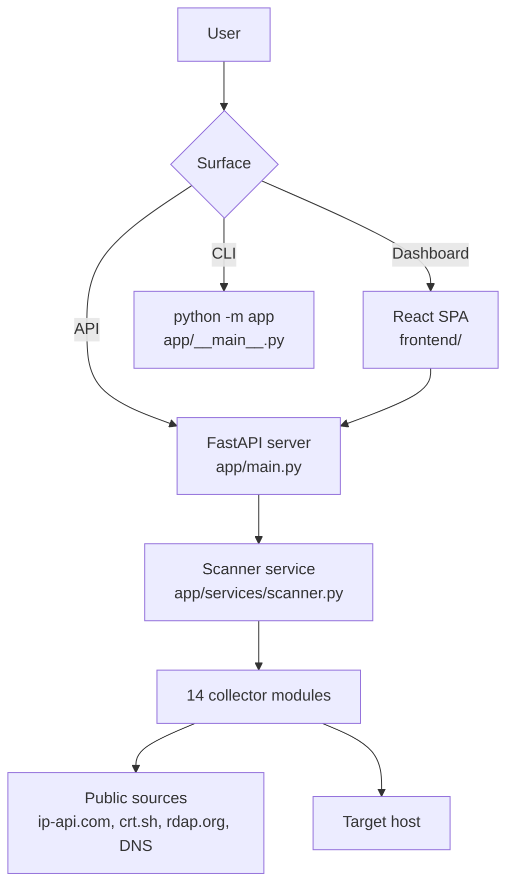

# GeoIntel

[](LICENSE)

> python -m app example.com -t full --json

IP and domain OSINT workspace with a web dashboard, JSON API, and command-line interface. GeoIntel combines common infrastructure lookups — geolocation, DNS, WHOIS, SSL, HTTP headers, RDAP, subdomains, email security, port scanning, and more — in one application. Each collector runs independently; the full-scan mode runs every collector concurrently.

> ⚠️ **Authorization is non-negotiable.** Port scanning, banner collection, connectivity checks, and zone-transfer checks are active. Only use this tool on assets you own or have explicit written authorization to test.

## Table of Contents

- [Features](#features)
- [Collectors](#collectors)
- [How It Works](#how-it-works)
- [Repository Structure](#repository-structure)
- [Tech Stack](#tech-stack)
- [Requirements](#requirements)
- [Installation](#installation)
- [Configuration](#configuration)
- [Usage](#usage)
- [Testing](#testing)
- [API Reference](#api-reference)
- [Examples](#examples)
- [Deployment](#deployment)
- [Troubleshooting](#troubleshooting)
- [Security and Legal Use](#security-and-legal-use)

## Features

- 🛰️ **14 intelligence collectors** — GeoIP, DNS, WHOIS, SSL, HTTP, reverse DNS, RDAP, subdomains, email security, web intel, public files, port scan, connectivity, zone transfer.
- 🌐 **Web dashboard** — React SPA with interactive map, per-collector result views, and optional OpenCage enrichment.
- 🖥️ **JSON API** — RESTful endpoints for every collector, returning structured JSON for integration.
- 📟 **Command-line interface** — `python -m app` with pretty, JSON, and simple output formats.
- ⚡ **Concurrent full scan** — Runs all collectors in parallel with partial-results resilience (one failure does not discard the rest).
- 🛡️ **Safety-first design** — Private/reserved addresses rejected for active modules; redirects revalidated; port scan bounded to TCP 1–1024 plus select high-value ports.
- 🔌 **No external dependencies for core collectors** — No API keys required; all passive lookups use public sources.

## Collectors

| ID | Operation | Target | Type |
| --- | :-: | --- | :-: |
| `quick` | IP geolocation, ISP, organisation, and ASN | IP or domain | Passive |
| `dns` | A, AAAA, MX, NS, TXT, SOA, CNAME, and PTR records | IP or domain | Passive |
| `whois` | Registrar, dates, status, nameservers, and contacts | Domain | Passive |
| `ssl` | Certificate subject, issuer, validity, and SANs | Public domain | Passive |
| `http` | Response and security headers | Public domain | Passive |
| `reverse` | Reverse DNS hostname and aliases | IP or domain | Passive |
| `rdap` | Structured IP or domain registration records | IP or domain | Passive |
| `subdomains` | Certificate-transparency subdomains from crt.sh | Domain | Passive |
| `email` | MX, SPF, and DMARC posture | Domain | Passive |
| `web` | Page metadata, technology signals, public emails, and social links | Public domain | Passive |
| `files` | `robots.txt`, `sitemap.xml`, and `security.txt` | Public domain | Passive |
| `ports` | TCP ports 1–1024, selected high-value ports, and service banners | Public IP or domain | Active |
| `connectivity` | TCP reachability and latency for SSH, SMTP, DNS, HTTP, and HTTPS | Public IP or domain | Active |
| `zone_transfer` | AXFR exposure checks against authoritative nameservers | Domain | Active |

`full` runs every collector concurrently via the CLI and `/api/full-scan` API. The dashboard runs one collector at a time.

## How It Works



Requests flow through the FastAPI backend to the scanner service, which dispatches each collector in its own thread. Active collectors (port scan, connectivity, zone transfer) are sandboxed behind the `_require_public_host` gate — they reject private and loopback addresses. Passive collectors make outbound HTTP or DNS queries to public intelligence sources. The dashboard communicates with the backend over REST; the CLI calls the same scanner functions directly.

## Repository Structure

```text
geointel/
├── api/
│   └── index.py              # Vercel serverless entry point (Mangum)
├── app/
│   ├── __main__.py            # CLI entry point (python -m app)
│   ├── main.py                # FastAPI application factory
│   ├── api/
│   │   └── routes.py          # REST endpoint definitions
│   ├── core/
│   │   └── geointel.py        # Core data models
│   ├── services/
│   │   └── scanner.py         # All 14 collector implementations
│   └── static/                # Legacy static frontend assets
├── frontend/
│   ├── src/
│   │   ├── components/        # React UI components
│   │   ├── pages/             # Docs, Status, Terms pages
│   │   ├── utils/             # OpenCage geocoding, export helpers
│   │   ├── api.ts             # Backend API client
│   │   ├── App.tsx            # Root SPA component
│   │   └── main.tsx           # App entry point
│   ├── public/                # Static assets (favicon, icons)
│   ├── vite.config.ts         # Vite build configuration
│   └── package.json
├── requirements.txt           # Python dependencies
├── vercel.json                # Vercel deployment configuration
└── test_scanner.py            # Backend smoke tests
```

## Tech Stack

| Layer | Choice |
| --- | --- |
| Framework | [FastAPI](https://fastapi.tiangolo.com/) + [Vite 8](https://vitejs.dev/) / [React 19](https://react.dev/) |
| Language | [Python 3.12+](https://python.org/) + [TypeScript 6](https://www.typescriptlang.org/) |
| Styling | [Tailwind CSS 4](https://tailwindcss.com/) |
| Maps | [Leaflet](https://leafletjs.com/) |
| CLI runtime | Python (`python -m app`) |
| Deployment | [Vercel](https://vercel.com/) (Python serverless + static) or local `uvicorn` |

## Requirements

- **Python 3.10+** (3.12 recommended for Vercel deployment)
- **Node.js 20+** and **npm** (for building the frontend)
- No external API keys required for core functionality

## Installation

### Web app (local)

```bash
# 1. Install Python dependencies
python -m pip install -r requirements.txt

# 2. Build the frontend
cd frontend
npm install
npm run build
cd ..

# 3. Start the server
uvicorn app.main:app --reload
```

```text
http://127.0.0.1:8000
```

### CLI only

```bash
python -m pip install -r requirements.txt
python -m app example.com -t dns
```

## Configuration

GeoIntel runs without any configuration. Optional settings are exposed through environment variables:

| Variable | Required | Default | Description |
| --- | :-: | --- | --- |
| `OPENCAGE_API_KEY` | ⛔ | none | Enables timezone, currency, and formatted address in GeoIP results (configured in the dashboard UI) |
| `MAX_WORKERS` | ⛔ | `50` | Thread pool size for concurrent collectors |

The OpenCage key is sent directly from the browser to OpenCage — it is not stored or proxied by the backend.

## Usage

### Dashboard

Start the server and open `http://127.0.0.1:8000`. Enter an IP, domain, or URL in the search bar. After the initial GeoIP result appears, select any collector from the module list to run an additional scan.

### CLI

```bash
# Basic GeoIP lookup
python -m app 8.8.8.8

# Specific collector
python -m app example.com -t dns

# Active port scan
python -m app example.com -t ports

# All collectors, JSON output
python -m app example.com -t full --json

# Flat key/value output
python -m app example.com -t rdap --simple
```

Run `python -m app --help` for the full list of scan types.

### REST API

```bash
# List all scan types
curl http://127.0.0.1:8000/api/scan-types

# Run one collector
curl -X POST http://127.0.0.1:8000/api/scan \
  -H 'Content-Type: application/json' \
  -d '{"target":"example.com","scan_type":"dns"}'

# Run all collectors
curl -X POST http://127.0.0.1:8000/api/full-scan \
  -H 'Content-Type: application/json' \
  -d '{"target":"example.com"}'
```

Full scans return successful results under `results` and failed collectors under `errors` — one upstream failure does not discard the rest of the report.

## Testing

```bash
# Frontend checks
cd frontend
npm run lint
npm run build
cd ..

# Backend smoke tests (no framework required)
python -c "from test_scanner import *; test_normalize_target(); test_page_parser(); test_full_scan_keeps_partial_results(); test_private_web_targets_are_rejected(); test_port_probe_formats_json_result()"
```

## API Reference

### `GET /api/scan-types`

Returns the list of available collectors.

**Response:**
```json
{
  "types": [
    { "id": "dns", "name": "DNS Analysis", "description": "A, AAAA, MX, NS records", "icon": "Network" }
  ]
}
```

### `POST /api/scan`

Run a single collector.

**Request:**
```json
{ "target": "example.com", "scan_type": "dns" }
```

**Response:** Collector-specific JSON.

### `POST /api/full-scan`

Run every collector concurrently.

**Request:**
```json
{ "target": "example.com" }
```

**Response:**
```json
{
  "target": "example.com",
  "resolved_ip": "93.184.216.34",
  "results": { "quick": { ... }, "dns": { ... } },
  "errors": null
}
```

## Examples

> ⚠️ Only scan systems you own or have written authorisation to test. The targets below are safe demonstration hosts.

| Target | Suggested collectors | Notes |
| --- | --- | --- |
| `8.8.8.8` | `quick`, `reverse`, `rdap` | Google public DNS — known geography |
| `example.com` | `dns`, `whois`, `ssl`, `http` | IANA reserved domain — low rate-limit risk |
| `github.com` | `web`, `subdomains`, `ports` | Large attack surface, may rate-limit |

## Deployment

| Path | Front-end | Backend | Notes |
| --- | --- | --- | --- |
| **Vercel** (recommended) | `frontend/dist/` (static) | Python serverless (`api/index.py`) | Auto-scaling, zero maintenance |
| **Local / VPS** | `frontend/dist/` (served by FastAPI) | `uvicorn` process | Full functionality, raw sockets work |

### Vercel

Import the repository into Vercel. `vercel.json` handles the build and routing automatically:

- Frontend built with `cd frontend && npm install && npm run build`
- API requests under `/api/*` routed to the Python serverless function
- All other routes serve the SPA's `index.html`

```bash
vercel --prod
```

### Local production

```bash
python -m pip install -r requirements.txt
cd frontend && npm install && npm run build && cd ..
uvicorn app.main:app --host 0.0.0.0 --port 8000
```

```text
http://localhost:8000
```

> Production runs `uvicorn` (not the Vite dev server). The built frontend is served directly by FastAPI.

## Troubleshooting

| Symptom | Cause | Fix |
| --- | --- | --- |
| Dashboard shows blank page or 404 | Frontend not built | `cd frontend && npm install && npm run build` |
| Collector returns error | Target unsuitable for that module or source unreachable | Use a domain for WHOIS/subdomains/email; verify network connectivity to crt.sh, RDAP, etc. |
| Port 8000 in use | Another process on that port | `uvicorn app.main:app --port 8080` |
| Active modules fail on Vercel | Serverless sandbox restricts raw sockets | Run locally or on a VPS for port/connectivity/zone-transfer scans |

## Security and Legal Use

- ✅ **Authorization required** — Only scan systems you own or have permission to test.
- ✅ **Private-address rejection** — Loopback, reserved, and RFC 1918 addresses are rejected for active modules.
- ✅ **Redirect revalidation** — HTTP redirects are checked before following.
- ✅ **Bounded active scanning** — Port scan limited to TCP 1–1024 plus select high-value ports; short timeouts.
- ❌ **No exploitation** — Does not brute-force, fuzz, or bypass access controls.
- ❌ **No data persistence** — Results are returned in the response and are not stored server-side.

## License

MIT


